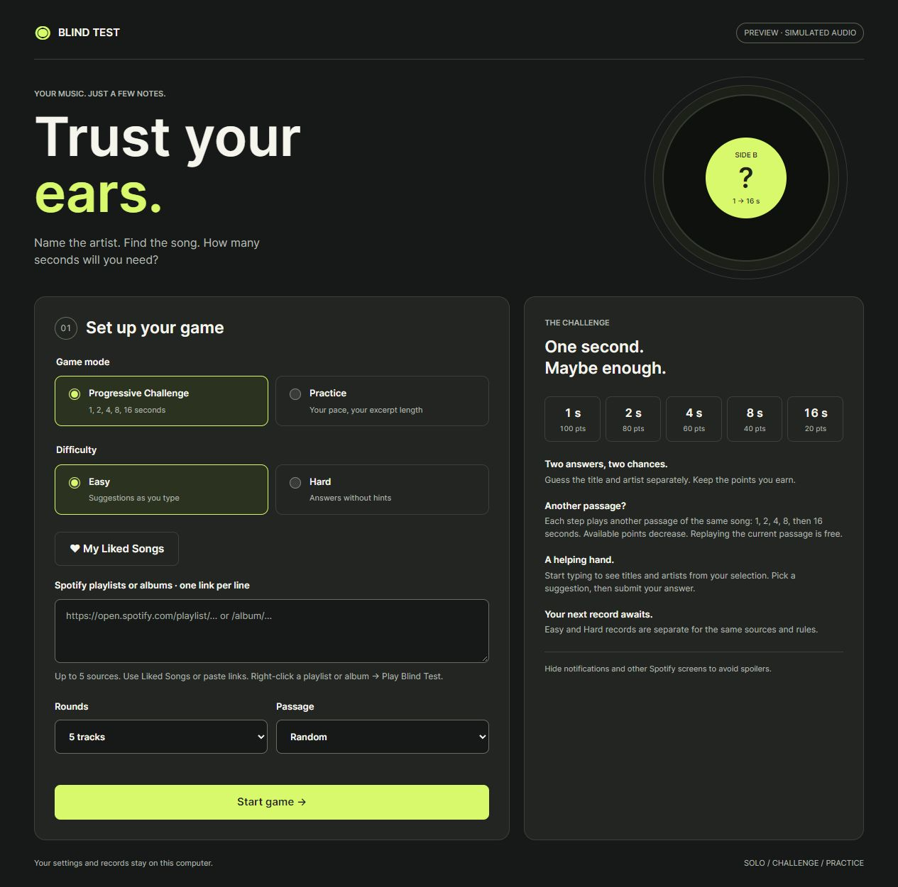

# Blind Test — 0.3.2

[](https://github.com/embark454/spicetify-blind-test/actions/workflows/ci.yml) · [MIT licensed](LICENSE) · Windows beta

A solo music quiz built into Spotify with Spicetify. Pick playlists, albums, or Liked Songs and identify each track and artist from short excerpts.

Experimental custom app, developed with Spicetify 2.45.1 on Windows. This repository contains the game and its tests. It is not an official Spotify application.

The game interface, context menus, and messages are in English. Original song titles, artist names, and playlist names are preserved.

[Download 0.3.2 — Windows beta](https://github.com/embark454/spicetify-blind-test/releases/tag/v0.3.2) · [Report a bug](https://github.com/embark454/spicetify-blind-test/issues) · [Changelog](CHANGELOG.md)



**Jump to:** [Install or update](#install-or-update) · [How to play](#play) · [Development](#development) · [Limitations](#validation-and-limitations)

## Install or update

Spicetify must already be installed and working with the Spotify desktop client.

1. Open the [download page](https://github.com/embark454/spicetify-blind-test/releases/tag/v0.3.2) and download **`blind-test-v0.3.2-windows.zip`** under **Assets**.
2. Extract the archive and open its **`blind-test`** folder.
3. On Windows, open PowerShell in that folder and run:

```powershell
.\INSTALLER.ps1
```

The installer copies the eight application files into `%APPDATA%\spicetify\CustomApps\blind-test`, adds the game alongside existing custom apps, and runs `spicetify apply`, which may restart Spotify. Node.js is not required to play.

If PowerShell prevents the script from running, install manually: copy the **`blind-test`** folder into `%APPDATA%\spicetify\CustomApps\`, then run:

```powershell
spicetify config custom_apps blind-test
spicetify apply
```

Developers can also clone this repository or use **Code → Download ZIP**. The installer is at the repository root.

The installer saves a dated backup of your configuration and any previous version in `sauvegardes`. These personal backups are excluded from Git and release archives.

To disable only this custom app:

```powershell
spicetify config custom_apps blind-test-
spicetify apply
```

## Play

1. Right-click an album or playlist and select the blind test menu item. Alternatively, open **Blind Test**, paste up to five playlist or album links, or use the **Liked Songs** shortcut. That shortcut replaces the current selection without starting playback.
2. Choose **Easy** or **Hard**, the game mode, the number of rounds, and whether excerpts start at the beginning or at a random position.
3. Start the game, listen to the excerpt, and enter the title, artist, or both.
4. Review your results, start a new selection, or practice the tracks you missed.

### Easy and Hard

- **Easy:** suggestions appear as soon as you start typing a title or artist. Up to eight matches come from the entire selected catalog, ignoring accents and capitalization. Click a suggestion, or use the arrow keys and Enter. This fills only the selected field; submit your answer separately. Escape closes the list without leaving the game. Free-text answers are also accepted.
- **Hard:** no suggestions. The same tolerance for small typing errors still applies.

Both difficulty levels work with Challenge and Practice. Scoring rules stay the same, with separate records for each difficulty. Previous records are retained under Hard, matching the earlier behavior. Your difficulty setting is saved locally.

### Progressive Challenge

| Excerpt | Points per answer |
| --- | --- |
| 1 second | 100 |
| 2 seconds | 80 |
| 4 seconds | 60 |
| 8 seconds | 40 |
| 16 seconds | 20 |

The title and artist earn points independently, up to **200 points per track**. Points already earned are retained. For example, finding the artist at one second and the title at eight seconds earns 100 + 40 = 140 points.

A wrong answer advances to the next step; a wrong answer at the final step reveals the solution. You can also request the next excerpt. A correct answer with the other field left blank lets you keep searching at the same step.

- **Beginning:** each step extends the same opening passage.
- **Random:** each step picks another passage from the same song, lasting 1, 2, 4, 8, then 16 seconds. Both the next-passage button and an incorrect answer change the position. Replaying or retrying a failed excerpt keeps its current position and costs no points.

New random passages avoid the earlier reserved 16-second windows when there is room. On shorter songs, overlap may be unavoidable; the game then picks the position farthest from previous starting points. Points already earned are retained when the passage changes.

### Practice

Choose an excerpt of 5, 10, 15, or 20 seconds. Each correct answer earns one point, with unlimited attempts. After revealing a track, you can manually accept an answer you previously entered; this marks the session as ineligible for records. Replaying missed tracks uses Practice mode, with 16-second excerpts after a Challenge, and is always excluded from records.

In Random Practice, **Another random passage** changes the position while keeping the selected duration, answers, and earned points. **Replay** plays the current passage again. Listen to the new passage before submitting another answer.

## Selection, matching, and records

- Mix up to five sources: playlists, albums, and Liked Songs. Duplicate track URIs are removed. To include favorites in a mixed selection, add `spotify:collection:tracks` on its own line.
- The draw favors tracks outside the last 100 tracks from completed sessions, then tries to vary artists. Small catalogs will necessarily repeat.
- Answer matching ignores accents, capitalization, and punctuation. It tolerates some small typos in longer names, credited guest artists, and common remaster/live suffixes. Matching is not perfect.
- Settings and records stay on your computer. Record categories depend on the sources, difficulty, mode, excerpt position, Practice duration, and actual number of rounds. Changing a playlist's contents does not create a new record category.
- Random-passage records from 0.3.1 use a separate category from the original fixed-position random mode. Earlier records stay stored, and Beginning-mode record categories are unchanged.
- Results show pairs found at one second in Challenge, recognized artists, and tracks to practice. Unfinished sessions are not resumed after closing the app.

## Playback and hidden answers

The game covers Spotify's interface during a session. Operating system notifications, Spotify Connect, and other devices can still reveal answers. Use **playback on this computer** for initial tests.

The player's volume is temporarily set to zero while an excerpt is prepared and positioned, then restored to its previous value. Timing uses the progress reported by Spotify. Leaving the game stops its excerpt; the previous listening session is not resumed automatically. If a player command stays blocked, the game asks you to restart Spotify.

Local files, podcasts, and unusable tracks are excluded. Each source supports up to 10,000 tracks, including Liked Songs. Challenge requires tracks lasting at least 17 seconds. If too few tracks are available, the game reduces the number of rounds.

## Development

See [CONTRIBUTING.md](CONTRIBUTING.md) for the development workflow and [RELEASING.md](RELEASING.md) for packaging, publication, and Marketplace troubleshooting.

### Marketplace distribution

This repository uses the `spicetify-apps` topic for discovery by the Spicetify Marketplace. Its root `manifest.json` supplies the app name, description, preview, README, author, and tags, alongside the runtime configuration. Marketplace indexing and cached results can delay discovery; the GitHub release is available directly.

Blind Test is a **custom app**. Marketplace users still need to follow the manual installation instructions above. A Marketplace listing does not imply endorsement by Spicetify or Spotify.

### Source files

- `app.js`: screens, answer inputs, and session flow.
- `core.js`: selection, answer variants, suggestions, rules, and scoring.
- `spotify.js`: loading playlists, albums, Liked Songs, and controlling excerpts.
- `storage.js`: local settings, records, and recent tracks.
- `launcher.js`: context menu integration for playlists, albums, and Liked Songs.
- `style.css`: presentation.
- `index.js` and `manifest.json`: Spicetify integration and Marketplace metadata.

Run the installer again after changing application files. This module adds no server, extra account, saved personal access token, analytics service, or music download.

### Run tests

With Node.js 22 or newer, run this command from the repository root:

```console
npm test
```

No dependencies need to be installed. Engine, storage, suggestions, and simulated playback tests run without Spotify. Checks against the installed application and Spicetify's actual menu constructor are skipped when their files are unavailable.

When reporting a bug, include your Spotify and Spicetify versions, reproduction steps, and the error message. Do not include login tokens, personal configuration files, or private playlist contents.

## Validation and limitations

The automated suite covers scoring, answer variants, suggestions against a 50,000-track catalog, selection, separate difficulty records, legacy record preservation, storage failure recovery, context menus, source loading, simulated playback, cancellation, and the generated Spicetify module.

Browser checks with simulated audio cover progressive scoring, persistent records, assisted practice, duplicate-free selections, a complete five-round session, loading errors, cancellation, the Liked Songs shortcut, mouse and keyboard suggestions, and the absence of suggestions in Hard mode.

**Real Spotify audio and the audible precision of one-second excerpts still need testing with a real account.** Simulated tests do not certify them. Phone multiplayer, public leaderboards, and automatic chorus detection are not included. Spotify's internal interfaces may change and require updates.

This is an unofficial prototype. The [Spotify Developer Policy](https://developer.spotify.com/policy), section III.2, prohibits games and trivia quizzes using its platform. Spicetify does not grant permission for that use.

## License

This project's code is available under the [MIT License](LICENSE). That license grants no rights to music, trademarks, or the Spotify service.
